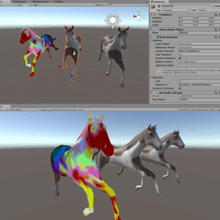

# Unity-InternalSkinningTest

test code for Unity built-in shader internalskinning.compute

using Unity built-in [internalskinning.compute](Assets/SkinningCompute/Shaders/internalskinning.compute) for GPU Skinning.

1. compute skinning with [ComputeShader](Assets/SkinningCompute/Shaders/skinning.compute)
2. compute skinning with [VertexShader](Assets/SkinningCompute/Shaders/vertexSkinning.shader)

## Refarence

- https://qiita.com/piti5/items/f101ba632085eea25775
- https://blogs.unity3d.com/jp/2018/04/16/animation-instancing-instancing-for-skinnedmeshrenderer/
- https://docs.unity3d.com/ja/current/ScriptReference/Mesh-bindposes.html